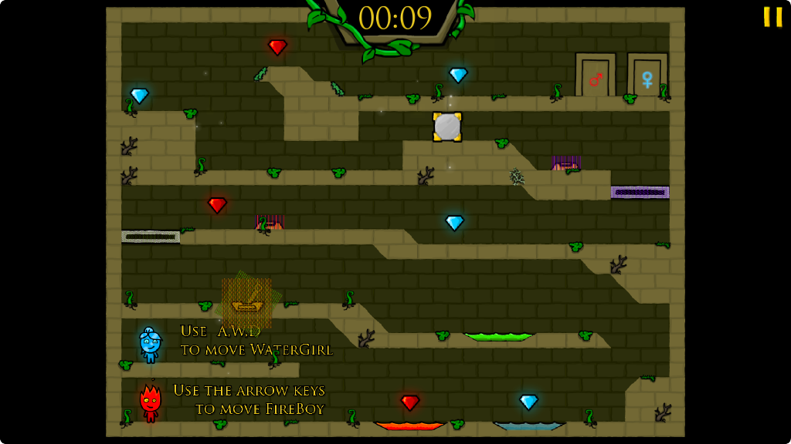

# Final Project Prototype

## Group Members:

Jonathan Tetry
Charles Wu

Period 5

# Intentions:

This is a replica of the popular web game Fireboy and Watergirl. The game is designed to be played with two players. The game is a simple platformer with the goal of both players reaching their corresponding exit door while collecting as many gems as possible and in as little time as possible. Fireboy moves with the arrow keys and Watergirl moves with WASD. Along the way, players will have to work together by jumping and interacting with the environment to achieve their goal.

### MVP Features:
1. Working tiles, movement and collision mechanics with players.
2. Basic interactive tiles: buttons, levers, doors.
3. Poisonous water that affects the proper player.
4. Gems that the proper player can collect.
5. Multiple levels with the tilemap.

### Good to Have Features:
1. Camera movement and zoom.
2. Moving blocks that they player can push.
3. Pulleys that the player can interact with.
4. Sloped tiles at a 45 degree angle
5. Robust animations of the player, and elements

This is the main menu of the game. Players will be able to see how well they completed each level and will be able to access the next levels in the tree. For a player to unlock the next level they must complete the previous level in the tree. The gem is gray when the level is not completed or not unlocked. Then the level becomes red if the player completed it without achieving the time or gem collection goal; purple if they only achieved the time goal; yellow if they only achieved the gen collection goal; and bright green if they achieved both the time and gem collection goal.

This is an image of the first level. It has multiple different elements such as the different colored gems and water which teaches the player how the core game mechanics work. We will recreate the first level to be exactly as it is and then create the rest of the levels of our own. This level contains levers, buttons, blue and red water, green water (which is poisonous to both players), sliding platforms, and a movable block (which is necessary to make a higher jump).

The level also contains a counter for the time at the top that ticks every second. There will also be a counter for the number of fire and water gems that the players have collected so far.

This our UML diagram. It contains the main Game class which runs a Map class which is an instance of a level. The level is stored as a tilemap in a text file with each different tile represented by a different ASCII character. The abstract Tile class stores the information about the tile. This includes textures. The abstract class has multiple subclasses that primarily override the collide command. A solid tile would repel the player and not allow them to collide, while colliding with a gem or lever interacts with the world. Colliding with a gem would collect it and remove it from the level.
