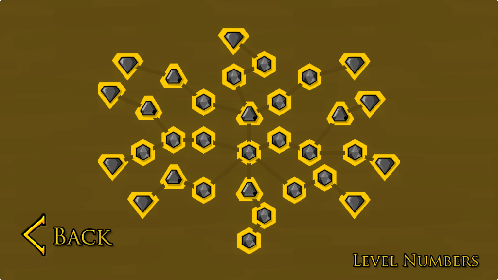
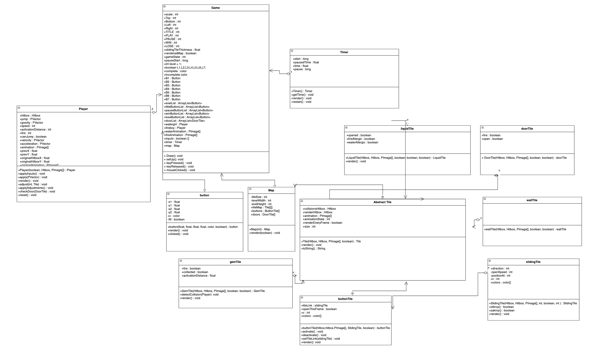
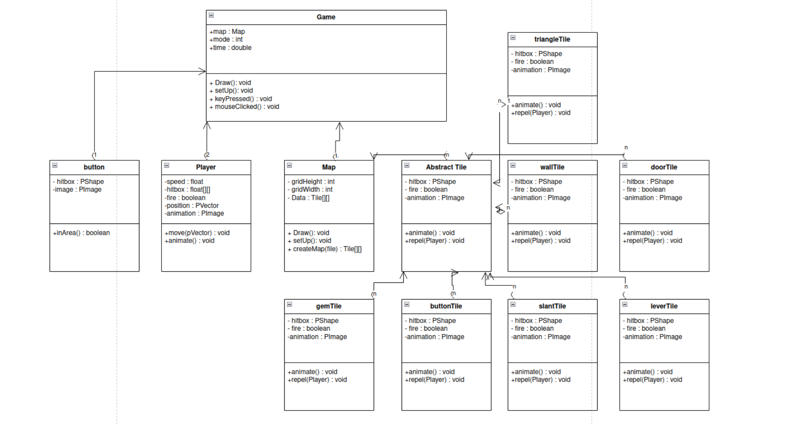

# Final Project Prototype

## Tetris Group:

Period 5

Group Members

- Jonathan Tetry
- Charles Wu

# Intentions:

This is a replica of the popular web game Fireboy and Watergirl. The game is designed to be played with two players. The game is a simple platformer with the goal of both players reaching their corresponding exit door while collecting as many gems as possible and in as little time as possible. Fireboy moves with the arrow keys and Watergirl moves with WASD. Along the way, players will have to work together by jumping and interacting with the environment to achieve their goal.

### MVP Features:
1. [COMPLETE] Working tiles, movement and collision mechanics with players.
2. [COMPLETE] Basic interactive tiles: buttons, ~levers~, doors. 
3. [COMPLETE] Poisonous water that affects the proper player.
4. [COMPLETE] Gems that the proper player can collect.
5. [COMPLETE] Multiple levels with the tilemap.

### Good to Have Features:
1. Camera movement and zoom.
2. Moving blocks that the player can push.
3. Pulleys that the player can interact with.
4. Sloped tiles at a 45 degree angle
5. Robust animations of the player, and elements

This is the main menu of the game. Players will be able to see how well they completed each level and will be able to access the next levels in the tree. For a player to unlock the next level they must complete the previous level in the tree. The gem is gray when the level is not completed or not unlocked. Then the level becomes red if the player completed it without achieving the time or gem collection goal; purple if they only achieved the time goal; yellow if they only achieved the gen collection goal; and bright green if they achieved both the time and gem collection goal.

This is an image of the first level. It has multiple different elements such as the different colored gems and water which teaches the player how the core game mechanics work. We will recreate the first level to be exactly as it is and then create the rest of the levels of our own. This level contains levers, buttons, blue and red water, green water (which is poisonous to both players), sliding platforms, and a movable block (which is necessary to make a higher jump).

The level also contains a counter for the time at the top that ticks every second. There will also be a counter for the number of fire and water gems that the players have collected so far.

(new/updated) This is our new UML diagram depicting the final project structure. 

#### Abstract Tile Class
The abstract Tile class is what stores the information for all different types of tiles in the game. By default it contains information of where it should be rendered (renderHitbox) and what to use for collisions (collisionsHitbox). Also it includes a place to store the sprite image and an aminationState (which would be used for animation if there are multiple images to cycle through). Additionally, the tiles also have a boolean if they should be rendered each frame. This is false for solid tiles who take up the who tile and true otherwise. Many subclasses override the render method because they do not use any specific image but use a combination of builtin processing shapes. Different tiles also have different instance variables and methods such as open and close for slidingTiles, activate and deactivate for buttonTiles and water and fireAllergic for liquidTiles.

#### Map Class
When the Map class is constructed by providing a level number, it reads through the level text file and then stores the tiles in a 2D array of Tiles. These tiles are then rendered onto the screen and used for the game. Additionally, the map stores seperate arrays of exit doors and buttons so that they can be accessed more easily later in the code without the need to loop over the entire level. During file parsing, if a button or a slidingTile is detected, it is temporarily stored. After parsing, a reference to the slidingTile is added to the ButtonTile so that the slidingTile can be moved when the button is activated. Additionally, the Map class is what updates and resets the ButtonTiles (steps 1 and 4 in the playing gamestate of the game loop).

#### Hitbox Class
The Hitbox class is what stores various information about an elemnts position and size. The position is represnted by a PVector and the size is represented by another PVector. There is also a boolean that disctates if collisions are on for the hitbox. This allows collision checking to be bypassed if collisions are not on for this hitbox. The hitbox class also stores an array with 4 booleans represting if it is currently colliding in each of the four cardinal directions. This is updated by the collide method which checks if two hitboxes are overlapping and then calculates the smallest overlap.

#### Player Class
The Player class has a hitbox that represents both where the player should be rendered and where collisons should be calculated at. Additionally the player also has booleans that determine what type the player is (fire or water) and if they can currently jump. The player also has velocity and acceleration PVectors and constants for gravity, jump power, and speed. The player class handles inputs based on what was detected in the Game file using applyInputs, the gravity is applied using apply. applyAdjustments loops through the nearest tiles to the player and checks collisions with each of their hitboxes, then is calles adjust with a direction in order to move the player properly. This is also where being inside of an exit door is checked, and the player colliding with a buttonTile or a gemTile is checked.

#### Timer Class
The timer class is what updates every second and record the amount of time that has passed since the level was started. The timer pauses when the player pauses the game, and resets when the player resets the level or starts a new level. The timer records the nanoTime and then displays the difference with the current time.

#### Button Class
This is the class that is responsible for all the buttons in the UI of the game. The Button class is created by specifying x and y positions of where it should be. The function of the button is determined by its position in the list of buttons which is stored in the Game file. Clicking detection is handled in the Game file and the position at which the Button is created is determined based on ratios to the current screen size based on the game's scale.

The Game file is what handles all of the player input, gamestates, and the game loop. During the gamestate of playing, the following is run:

#### Gamestate Playing
1. The buttons within the levels are reset. This means that the buttons will be reset so that they have not yet been activated this frame. This makes sure that a button cannot be activated multiple times per frame, or be activated even after a player is no longer standing on top if it.
2. Inputs are processed for each player. Horizontal speed is simply just chaning the x position of the player's hitbox by speed pixels. Vertical movement is done with PVectors. Gravity with a negative acceleration is applied to the current vertical velocity each frame. Additionally, when a player jumps, a positive acceleration is added for that frame. This is also where checkig happens if a player is allowed to jump at that moment.
3. Player position is adjusted. After applying inputs, the player may be inside of a solid tile that they are not supposed to be in. First, collisions are checked in the hitbox class. This is done by calculating if a hitbox is partly inside of another hitbox, and then calculating the direction of smallest overlap. This then updates both the player's and the tile's collisions array. Based on the directions in which the player collided, they are then adjusted accordingly so that they are no longer inside of that tile. If the player is adjusted up, their jumping ability is also reset. During adjustment, if it is detected that a player is adjusted to the top of a button, the button is activated.
4. The buttons that have not been activated are deactivated. This results in the linked slidingTile closing if a player has not stood on the button this frame.
5. All elements are rendered. Elements that have no transparent portions (when the collisionsHitbox and the renderHitbox are the same and occupy the whole tile) are not rendered in order to improve efficiency. Otherwise all buttons, slidingTiles, and liquids are rendered. The background tiles are only rendered if they are within close range of the player's current position. Finally, the players are rendered.

#### Other Gamestates
During other gamestates, a static image of the menu is rendered. Then the user's mouse position and mouse clicks are determined to be clicking on a button or not. The button positioning is not fixed, and is based on the current scaling of the game's screen. This would allow it to work even if the scale were to be changed. If it is detected that a button was clicked, its function gets executed.

~This our OLD UML diagram. It contains the main Game class which runs a Map class which is an instance of a level. The level is stored as a tilemap in a text file with each different tile represented by a different ASCII character. The abstract Tile class stores the information about the tile. This includes textures. The abstract class has multiple subclasses that primarily override the collide command. A solid tile would repel the player and not allow them to collide, while colliding with a gem or lever interacts with the world. Colliding with a gem would collect it and remove it from the level.~
Work on this project will be divided into multiple stages:

#### Stage 1
1. Have a working tilemap that renders on the screen.
2. Have a Player that can move with key presses.
3. Add gravity so that the player falls to the ground.

#### Stage 2
1. Have working collisions between any Tile and Player.
2. Add different types of water that can harm their respective player.
3. Allow gems to be collected.
4. Create a timer at the top of the screen.

#### Stage 3
1. Add doors that, when both opened simultaneously, end the level.
2. Add buttons that allow to be pressed and move platforms.
3. Add collision between the players and the platforms.

#### Stage 4
1. Add levers that can be interacted with.
2. Add blocks that can be pushed around by the players in order to clear longer jumps.
